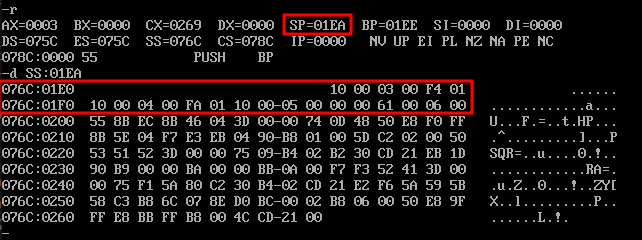
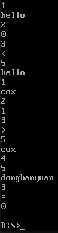

# 第四次实验作业

[作业要求](requirements.md)

- [第一题](STRCAT.ASM) 键盘输入字符串，与样本串拼接并输出。
- [第二题](FACT.ASM) 计算 $6!$，在 DEBUG 模式下当 N=3 时画出堆栈图。
- [第三题](FUNC.ASM): 构造 5 个子程序（字符串输入，字符查找，字符串比较，字符串复制，字符串输出），无限循环键盘输入索引 1-5，用段内间接寻址调用子程序 `CALL BX`，键盘输入 0 则退出程序。

   对于子程序 2 和 3（字符查找和字符串比较）需要特别输出结果，但由于题目要求使用跳转表调用子程序，并在主程序中输出，所以这里写的略丑，在主循环中单独写了很长的一段判断和输出的代码。

   另外为了提高交互时控制台内容的可读性，在 DOS 中断调用输入及输出后，额外输出了一个换行符。

## 第二题运行栈

Debug 模式截图:



运行栈示意图

```
        +--------+
  IP    |  0010h |  01EA (<- SP)
        +--------+
  N=3   |  0003h |  01EC
        +--------+
  BP    |  01F4h |  01EE
        +--------+
  IP    |  0010h |  01F0
        +--------+
  N=4   |  0004h |  01F2
        +--------+
  BP    |  01FAh |  01F4
        +--------+
  IP    |  0010h |  01F6
        +--------+
  N=5   |  0005h |  01F8
        +--------+
  BP    |  0000h |  01FA
        +--------+
  IP    |  0061h |  01FC
        +--------+
  N=6   |  0006h |  01FE
        +--------+
        ..........  0200
```

## 第三题运行结果

