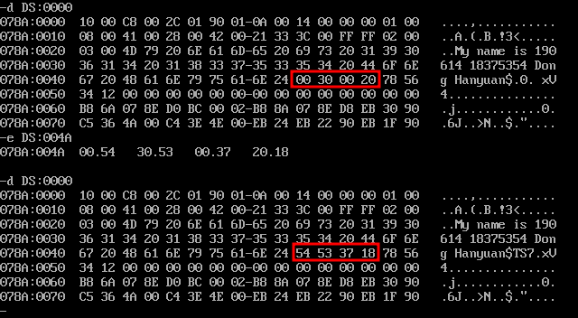
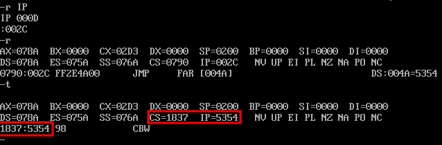
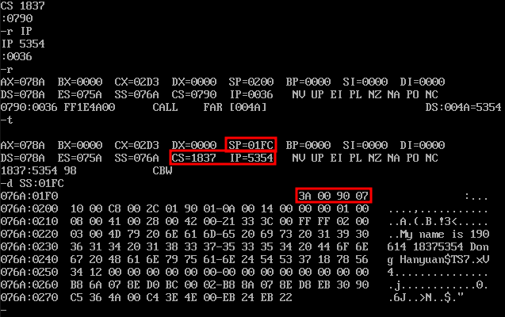

# 段间转移及调用指令解读

## 水印地址及内容

`ADD1` 位于 `078A:004A` 地址处。水印内容为 `18375354H`

## `JMP` 执行后的 `CS:IP` 值

执行完 `JMP DWORD ADD1` 后，`CS:IP` 变为 `1837:5354`。

## `CALL` 执行后的栈顶

执行完 `CALL DWORD ADD1` 后，`SP=01FC`，`SS:[SP]` 处的双字为 `0790003AH`，即 `0790:003A`，也就是 `CALL DWORD ADD1` 的下一条指令的地址。

